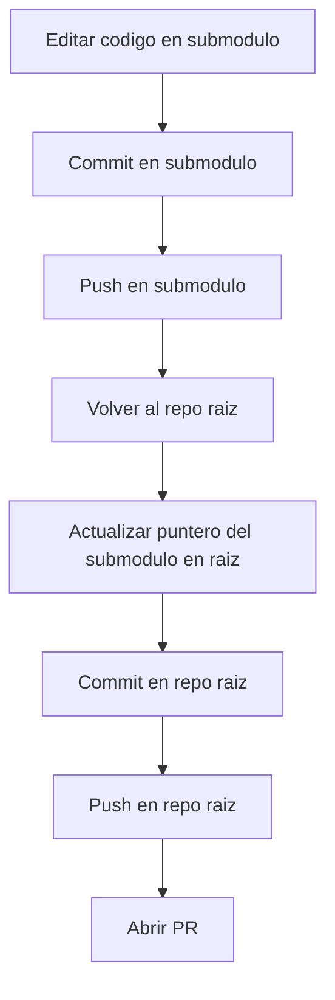

# Products Launcher - Guia Operativa

Esta guia documenta el flujo recomendado para trabajar en este repo con submodulos, Docker Compose, seeds y despliegue de cambios.

## 1) Mapa del repositorio

- Repo raiz: orquesta servicios y guarda punteros de submodulos
- Submodulo 1: client-gateway
- Submodulo 2: products-ms
- Submodulo 3: orders-ms

## 2) Flujo visual de trabajo (submodulos + repo raiz)



## 3) Primer setup local

1. Clonar con submodulos:

```bash
git clone --recurse-submodules <url-del-repo>
```

2. Crear entorno local:

```bash
cp .env.example .env.local
```

3. Instalar deps locales para IntelliSense (VS Code):

```bash
cd products-ms && corepack pnpm install
cd ../orders-ms && corepack pnpm install
cd ../client-gateway && corepack pnpm install
cd ..
```

Nota: Docker instala deps dentro de contenedores para ejecutar, pero esta instalacion local evita errores ts(2307) en el editor.

## 4) Levantar entorno de desarrollo

```bash
docker compose --env-file .env.local up -d --build
```

Ver estado:

```bash
docker compose --env-file .env.local ps
```

Apagar:

```bash
docker compose --env-file .env.local down
```

## 5) Ver logs por microservicio

Tiempo real de un servicio:

```bash
docker compose --env-file .env.local logs -f products-service
```

Varios servicios:

```bash
docker compose --env-file .env.local logs -f products-service orders-service
```

Ultimos N minutos:

```bash
docker compose --env-file .env.local logs --since=10m products-service
```

## 6) Seed de datos

Con servicios arriba:

```bash
docker compose --env-file .env.local exec products-service pnpm db:seed
docker compose --env-file .env.local exec orders-service pnpm db:seed
```

## 7) Flujo Git correcto con submodulos

### Paso A - Commit/Pull/Push en cada submodulo

Ejemplo products-ms:

```bash
cd products-ms
git add .
git commit -m "feat: tu cambio en products"
git push origin <tu-rama>
```

Repite para orders-ms y client-gateway si tuvieron cambios.

### Paso B - Actualizar repo raiz con nuevos punteros

```bash
cd ..
git add products-ms orders-ms client-gateway
git add docker-compose.yml docker-compose.override.yml docker-compose.prod.yml README.md scripts docs
git commit -m "chore: update submodule pointers and root config"
git push origin <tu-rama>
```

## 8) Orden recomendado de PRs

1. PR de cada submodulo
2. Esperar merge de submodulos
3. PR del repo raiz (actualiza punteros)

## 9) Troubleshooting rapido

### Submodulo en detached HEAD

Sintoma:

- `git branch` muestra `* (HEAD detached from <commit>)`

Causa:

- El repo raiz guarda el commit exacto de cada submodulo (puntero), no una rama.
- Al ejecutar `git submodule update` o cambiar de commit en el repo raiz, el submodulo puede quedar en detached HEAD.

Prevencion antes de editar:

```bash
cd client-gateway
git branch --show-current
```

Si sale vacio, crea o cambia a rama antes de trabajar:

```bash
git switch -c feature/tu-cambio
# o
git switch main && git pull
```

Recuperacion segura si ya hiciste commit en detached HEAD:

```bash
# Crear rama apuntando al commit actual
git switch -c fix/recuperar-commit

# Subir rama para no perder el commit
git push -u origin fix/recuperar-commit
```

Checklist rapido:

1. No commitear si `git status -sb` muestra `## HEAD (no branch)`.
2. Confirmar rama con `git branch --show-current` antes de `git commit`.
3. Push del submodulo primero, luego commit/push del repo raiz para actualizar punteros.

### Error: Cannot find module '@nestjs/core' en VS Code

Causa comun: faltan node_modules locales o quedaron creados por root.

Fix:

```bash
sudo chown -R $USER:$USER products-ms/node_modules orders-ms/node_modules client-gateway/node_modules || true
rm -rf products-ms/node_modules orders-ms/node_modules client-gateway/node_modules
cd products-ms && corepack pnpm install
cd ../orders-ms && corepack pnpm install
cd ../client-gateway && corepack pnpm install
cd ..
```

Luego en VS Code ejecuta: TypeScript: Restart TS Server.

### Warning de Compose sobre watch y bind mounts

Si aparece warning de rutas no monitorizadas, evita mezclar develop.watch y bind mounts en la misma ruta.

## 10) Comandos utiles de diario

```bash
# Arrancar dev
./scripts/dev-up.sh

# Apagar dev
./scripts/dev-down.sh

# Produccion (local test)
./scripts/prod-up.sh
./scripts/prod-down.sh
```

---

Si el equipo sigue este documento, evita el 90% de errores comunes en submodulos, Docker y Prisma.
